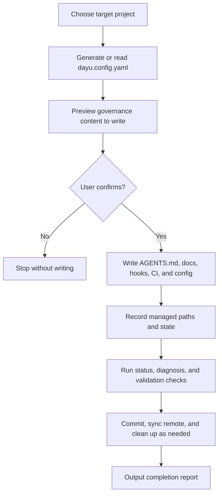

<div align="center">


<br>

# Dayu Harness Skill

### *“Write project rules into the repository so governance keeps working after the tool leaves.”*

[](LICENSE)
[](https://agentskills.io)
[](https://github.com/kinoward/dayu-harness-skill/stargazers)

[](https://claude.ai/code)
[](https://github.com/kinoward/dayu-harness-skill)
[](https://github.com/kinoward/dayu-harness-skill)
[](https://github.com/kinoward/dayu-harness-skill)

<br>

中文说明文档见 [README.md](README.md)。

<br>

<table>
<tr><td align="left">

🧭 &nbsp;Are your project rules still scattered across chat logs, PR comments, spoken conventions, and old docs?<br>
🧰 &nbsp;Do you want one entrypoint for commits, PRs, issues, releases, and quality checks?<br>
📦 &nbsp;Do you want the tool to be removable after setup while the rules keep working in the project?

</td></tr>
</table>

### ✨ Dayu Harness deploys those rules into your repository.

<br>

[🧭 Introduction](#-introduction) · [🧩 Prerequisites](#-prerequisites) · [🚀 Quick Start](#-quick-start) · [🛠️ Five Function Areas](#-five-function-areas)

[🔁 CLI Framework](#-cli-framework) · [📦 Written Files](#-written-files) · [🧭 How To Choose](#-how-to-choose) · [🌐 Bilingual And Compatibility](#-bilingual-and-compatibility)

[📁 Project Structure](#-project-structure) · [📚 More Docs](#-more-docs) · [🤝 Contributing](#-contributing) · [⭐ Star History](#-star-history)

</div>

---

## 🧭 Introduction

Dayu Harness Skill is a repository governance deployment tool. It writes project rules, documentation structure, check scripts, Git hooks, GitHub Actions, and common configuration into the target repository, so those rules can be versioned, reviewed, and moved with the project.

It is not a long-running service, and it is not a prompt pack that only works inside one chat window. After initialization or maintenance, you can remove the tool installation directory; the long-lived source of truth is the target project’s `AGENTS.md`, `docs/`, `.husky/`, `.github/`, config files, and state records.

It fits these situations:

- A new project wants a clear project entrypoint, documentation skeleton, and baseline Git rules from day one.
- An existing project has scattered docs, hooks, CI, or commit rules that need one maintainable structure.
- A team wants shared rules for commits, PRs, issues, releases, and quality checks instead of repeated manual reminders.
- A project needs the same repository rules across Claude Code, Codex, Cursor, Copilot, and similar tools.

## 🧩 Prerequisites

For basic use, prepare:

- Git: initializes repositories, installs hooks, detects the default branch, and commits governance files.
- Node.js LTS: runs `npx dayu-harness` and installs governance tooling.
- npm / npx: provided by Node.js, used to run the CLI and install required local check dependencies.
- jq: used by environment check scripts to read JSON configuration.

Prepare as needed:

- Python 3: used when PR, issue, or test-policy checks are enabled.
- PyYAML: used when GitHub workflow YAML validation is needed.
- GitHub CLI `gh`: required for GitHub repository, PR, issue, branch protection, or release-related features, with `gh auth login` completed first.

Note: Node/npm are mainly used to run governance tools and local checks. Your application itself does not have to be a Node.js app. If the target project lacks `package.json`, the tool will prompt for initialization only when needed.

## 🚀 Quick Start

If you only want the CLI:

```bash
cd <target-project>
npx dayu-harness init --target .          # preview only by default
npx dayu-harness init --target . --apply  # write default governance content after confirmation
npx dayu-harness status --target .        # inspect current governance status
```

If you want guided setup through the Skill entrypoint:

```bash
cd <target-project>
npx skills add kinoward/dayu-harness-skill
```

After installation, enter this in a client that supports Skills:

```text
/dayu-harness
```

The tool first analyzes the target project, then guides initialization, existing-config fusion, completeness diagnosis, or drift repair. Existing hooks, CI, lint, and release config are not overwritten by default; the tool presents a preview or merge proposal first.

After use, you can remove the Skill installation directory:

```bash
npx skills remove dayu-harness
```

<details>
<summary>Manual installation for Claude Code or Codex</summary>

For manual installation, copy the files and remove the nested `.git` directory to avoid leaving a nested Git repository in the target project.

Claude Code:

```bash
cd <target-project>
tmp_dir="$(mktemp -d)"
git clone --depth 1 https://github.com/kinoward/dayu-harness-skill.git "$tmp_dir/dayu-harness-skill"
mkdir -p .claude/skills
cp -R "$tmp_dir/dayu-harness-skill" .claude/skills/dayu-harness
rm -rf .claude/skills/dayu-harness/.git "$tmp_dir"
```

Codex:

```bash
cd <target-project>
tmp_dir="$(mktemp -d)"
git clone --depth 1 https://github.com/kinoward/dayu-harness-skill.git "$tmp_dir/dayu-harness-skill"
mkdir -p .agents/skills
cp -R "$tmp_dir/dayu-harness-skill" .agents/skills/dayu-harness
rm -rf .agents/skills/dayu-harness/.git "$tmp_dir"
```

Remove:

```bash
rm -rf .claude/skills/dayu-harness
rm -rf .agents/skills/dayu-harness
```

</details>

## 🛠️ Five Function Areas

| Area | What It Includes | When To Enable It |
| --- | --- | --- |
| Initialization and deployment | Project entry indexes, documentation skeleton, maintenance scripts, `.gitignore`, project status snapshot | New projects, or existing projects that need one entrypoint |
| Rule deployment | Commit conventions, PR/issue conventions, branch protection, release version rules, test strategy | Teams that want rules in the repository instead of spoken convention |
| Automatic checks | commit hook, pre-push hook, GitHub Actions, lint/format, fixed-format renderer | Projects that want problems caught before commit, push, PR, or release |
| Fusion and repair | Existing-config diff preview, keep/replace/skip strategy, drift diagnosis and repair | Existing projects with docs, hooks, CI, or lint config already present |
| Status and completion | Status view, consistency validation, precise commit, remote sync, and test artifact cleanup | After writing files, when you need to confirm governance works |

Default content focuses on baseline governance; GitHub, release automation, and Node.js quality tooling are enabled as needed.

## 🔁 CLI Framework

The CLI handles deterministic execution: read config, plan written content, deploy files, record state, and check results. Common commands are grouped by purpose:

| Group | Commands | Purpose |
| --- | --- | --- |
| Config and deployment | `init`, `apply` | Create config, preview content, write governance content |
| Fusion and generation | `merge`, `generate` | Handle existing projects, or render preview content only |
| Repair and checks | `repair`, `status`, `diagnose`, `validate` | Repair drift, inspect status, check completeness |
| Completion | `finalize` | Verify, commit, sync remote when requested, and clean temporary artifacts |

Overall flow:



More command details are in [docs/getting-started.md](docs/getting-started.md) and [docs/configuration.md](docs/configuration.md).

## 📦 Written Files

Common written files include:

- `AGENTS.md` and required subdirectory indexes: entrypoints for project rules and docs.
- `docs/harness/`: maintenance instructions, collaboration guides, check scripts, and review materials.
- `.husky/`: local hooks for commit messages, push protection, quality checks, and related workflows.
- `.github/`: PR/issue checks, release automation, repository policy, and ruleset templates.
- Config files such as `commitlint.config.cjs`, `eslint.config.cjs`, `.prettierrc`, and `.lintstagedrc.json`.
- Long-lived documentation directories such as `docs/design-docs/`, `docs/troubleshooting/`, `docs/references/`, `docs/product-specs/`, and `docs/archive/`.
- `.dayu-harness/managed-paths.json`: records long-lived paths managed by the tool for later diagnosis, repair, and precise commits.

Temporary locks, runtime logs, and caches are not committed as long-lived governance assets.

## 🧭 How To Choose

Dayu Harness borrows ideas from gstack, Spec Kit, OpenSpec, and related projects, but it has a different target. This comparison helps decide when each tool is useful.

| Project | Better For | How Dayu Harness Differs |
| --- | --- | --- |
| [gstack](https://github.com/garrytan/gstack) | Organizing Claude Code into product, design, review, QA, and release workflows | Dayu does not provide a full workflow team; it writes project rules and check assets into the repository so they last |
| [GitHub Spec Kit](https://github.github.com/spec-kit/index.html) | Organizing feature development around specs, plans, tasks, and implementation | Dayu does not replace spec-driven development; it adds repository entrypoints, hooks, CI, health checks, and existing-project fusion |
| [OpenSpec](https://openspec.dev/) | Managing requirement evolution with lightweight specs and change directories | Dayu does more than manage requirement specs; it deploys checkable, repairable, portable project governance assets |

Choose this way:

- Need stronger personal or team workflow orchestration: start with gstack.
- Need a complete spec workflow for new features: start with Spec Kit.
- Need lightweight requirement changes reviewed with code: start with OpenSpec.
- Need rules, docs, hooks, CI, and check scripts written into the repository: use Dayu Harness.

These tools can be combined. Dayu Harness focuses on the project’s own long-lived rules, without requiring you to abandon your existing development flow.

## 🌐 Bilingual And Compatibility

Dayu Harness uses Chinese as the source language and provides mirrored English documentation and English deployment templates. When running `/dayu-harness`, key questions and options are shown in Chinese and English; deployment writes one language into the target project, defaults to Chinese, and writes English content only when explicitly selected.

It stays neutral across coding assistants: the long-lived target-project assets are Markdown, Node hooks, YAML workflows, and common configuration files. After the tool is removed, project rules remain in the repository.

## 📁 Project Structure

The README only shows a high-level structure; the full directory tree and maintenance rules are in [AGENTS.md](AGENTS.md).

- Entry points and descriptions: `README.md`, `README.en.md`, `AGENTS.md`, `SKILL.md`
- CLI and config: `src/`, `package.json`, `tsconfig.json`
- Deployment materials: `templates/`, `templates.en/`, `assets/`, `locales/`
- Governance list and TypeScript CLI: `capabilities/`, `src/`
- Usage and maintenance docs: `docs/`, `references/`
- Archived tests and fixtures: `archive/tests/`

## 📚 More Docs

- [docs/getting-started.md](docs/getting-started.md): CLI quick start.
- [docs/configuration.md](docs/configuration.md): `dayu.config.yaml` configuration reference.
- [docs/troubleshooting.md](docs/troubleshooting.md): common troubleshooting.
- [references/agent-compatibility.md](references/agent-compatibility.md): compatibility across clients.
- [AGENTS.md](AGENTS.md): complete maintenance entrypoint for this repository.

## 🤝 Contributing

Issues and PRs are welcome: bug reports, usage feedback, compatibility adaptations, and documentation improvements are all valuable.

> [!TIP]
>
> We want this repository to be a reusable project governance tool: preserving rules, check scripts, documentation entrypoints, and long-term maintenance experience so more projects can install, review, and adjust them directly.
>
> **Organization maintainer:** [@kinoward](https://github.com/kinoward)

[][github-issues-link]
[][github-prs-link]

[github-issues-link]: https://github.com/kinoward/dayu-harness-skill/issues
[github-prs-link]: https://github.com/kinoward/dayu-harness-skill/pulls

<!-- contributors:start -->
<table>
  <tr>
    <td align="center" width="96">
      <a href="https://github.com/kinoward">
        <br>
        <sub><b>kinoward</b></sub>
      </a>
    </td>
  </tr>
</table>
<!-- contributors:end -->

## ⭐ Star History

<a href="https://www.star-history.com/?repos=kinoward%2Fdayu-harness-skill&type=date&legend=top-left">
 <picture>
   <source media="(prefers-color-scheme: dark)" srcset="https://api.star-history.com/image?repos=kinoward/dayu-harness-skill&type=date&theme=dark&legend=top-left" />
   <source media="(prefers-color-scheme: light)" srcset="https://api.star-history.com/image?repos=kinoward/dayu-harness-skill&type=date&legend=top-left" />
   
 </picture>
</a>

---

<div align="center">

<p><strong>MIT License</strong> © <a href="https://github.com/kinoward">kinoward</a></p>

<sub>Made for projects that want repository rules to keep working after setup is done.</sub>

</div>
