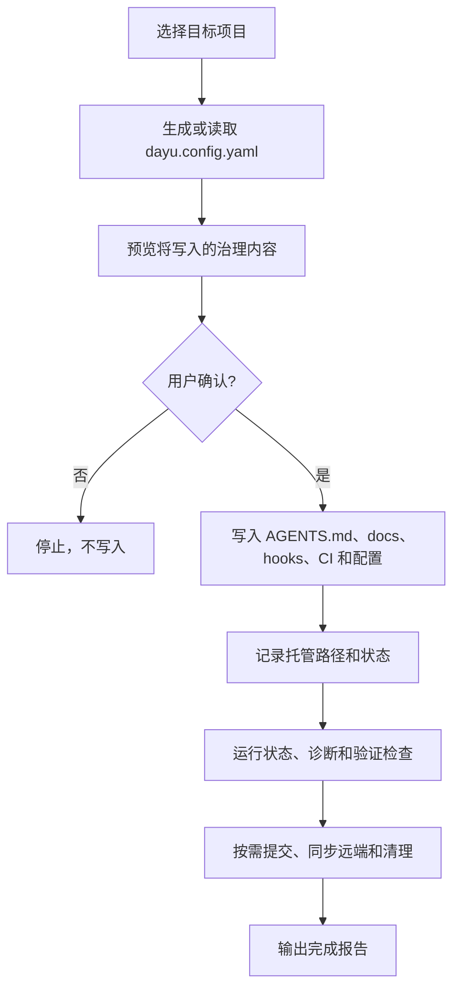

<div align="center">


<br>

# Dayu Harness Skill（大禹治库.skill）

### *“把项目规则写进仓库，让治理在工具离开后继续生效。”*

[](LICENSE)
[](https://agentskills.io)
[](https://github.com/kinoward/dayu-harness-skill/stargazers)

[](https://claude.ai/code)
[](https://github.com/kinoward/dayu-harness-skill)
[](https://github.com/kinoward/dayu-harness-skill)
[](https://github.com/kinoward/dayu-harness-skill)

<br>

English documentation is available in [README.en.md](README.en.md).

<br>

<table>
<tr><td align="left">

🧭 &nbsp;你的项目规则还散在聊天记录、PR 评论、口头约定和旧文档里？<br>
🧰 &nbsp;你希望提交、PR、Issue、发布和质量检查有统一入口？<br>
📦 &nbsp;你希望工具跑完即可移除，规则仍留在项目里继续生效？

</td></tr>
</table>

### ✨ Dayu Harness 用来把这些规则部署进你的仓库。

<br>

[🧭 项目介绍](#-项目介绍) · [🧩 前置环境](#-前置环境) · [🚀 快速开始](#-快速开始) · [🛠️ 五类功能](#-五类功能)

[🔁 CLI 框架](#-cli-框架) · [📦 写入内容](#-写入内容) · [🧭 怎么选择](#-怎么选择) · [🌐 双语与兼容](#-双语与兼容)

[📁 项目结构](#-项目结构) · [📚 更多文档](#-更多文档) · [🤝 参与贡献](#-参与贡献) · [⭐ Star History](#-star-history)

</div>

---

## 🧭 项目介绍

Dayu Harness Skill（大禹治库）是一个仓库治理部署工具。它会把项目规则、文档结构、检查脚本、Git hooks、GitHub Actions 和常用配置写入目标仓库，让这些规则跟随项目版本一起保存、审查和迁移。

它不是长期运行的服务，也不是只在某个聊天窗口里生效的提示词包。初始化或维护完成后，可以删除工具安装目录；真正长期生效的是目标项目里的 `AGENTS.md`、`docs/`、`.husky/`、`.github/`、配置文件和状态记录。

适合这些场景：

- 新项目想从第一天就有清晰的项目入口、文档骨架和基础 Git 约束。
- 旧项目已有零散文档、hooks、CI 或提交规则，需要整理成一套可维护的结构。
- 团队希望提交、PR、Issue、发布和质量检查有统一规则，而不是靠每次人工提醒。
- 项目需要在 Claude Code、Codex、Cursor、Copilot 等工具之间保持同一套仓库规则。

## 🧩 前置环境

基础使用建议先准备：

- Git：用于初始化仓库、安装 hooks、识别默认分支和提交治理文件。
- Node.js LTS：用于运行 `npx dayu-harness` 和安装治理工具链。
- npm / npx：随 Node.js 提供，用于执行 CLI 和安装必要的本地检查依赖。
- jq：用于环境检查脚本读取 JSON 配置。

按需准备：

- Python 3：启用 PR、Issue 或测试策略检查时会用到。
- PyYAML：需要校验 GitHub workflow YAML 时会用到。
- GitHub CLI `gh`：启用 GitHub 仓库、PR、Issue、分支保护或发布相关功能时需要，并需先完成 `gh auth login`。

说明：Node/npm 主要用于运行治理工具和本地检查，不代表你的业务项目必须是 Node.js 应用。目标项目缺少 `package.json` 时，工具会在需要时提示初始化。

## 🚀 快速开始

如果只想使用 CLI：

```bash
cd <target-project>
npx dayu-harness init --target .          # 默认只预览，不写入
npx dayu-harness init --target . --apply  # 确认后写入默认治理内容
npx dayu-harness status --target .        # 查看当前治理状态
```

如果想通过 Skill 入口获得引导：

```bash
cd <target-project>
npx skills add kinoward/dayu-harness-skill
```

安装后，在支持 Skills 的客户端中输入：

```text
/dayu-harness
```

工具会先分析目标项目，再引导你初始化、融合已有配置、诊断完整性或修复漂移。已有 hooks、CI、lint、发布配置默认不会被直接覆盖，会先给出预览或合并方案。

使用完成后可以移除 Skill 安装目录：

```bash
npx skills remove dayu-harness
```

<details>
<summary>手动安装到 Claude Code 或 Codex</summary>

手动安装时建议复制文件并移除内层 `.git`，避免在目标项目中留下嵌套 Git 仓库。

Claude Code：

```bash
cd <target-project>
tmp_dir="$(mktemp -d)"
git clone --depth 1 https://github.com/kinoward/dayu-harness-skill.git "$tmp_dir/dayu-harness-skill"
mkdir -p .claude/skills
cp -R "$tmp_dir/dayu-harness-skill" .claude/skills/dayu-harness
rm -rf .claude/skills/dayu-harness/.git "$tmp_dir"
```

Codex：

```bash
cd <target-project>
tmp_dir="$(mktemp -d)"
git clone --depth 1 https://github.com/kinoward/dayu-harness-skill.git "$tmp_dir/dayu-harness-skill"
mkdir -p .agents/skills
cp -R "$tmp_dir/dayu-harness-skill" .agents/skills/dayu-harness
rm -rf .agents/skills/dayu-harness/.git "$tmp_dir"
```

移除：

```bash
rm -rf .claude/skills/dayu-harness
rm -rf .agents/skills/dayu-harness
```

</details>

## 🛠️ 五类功能

| 功能 | 包含内容 | 适合什么时候启用 |
| --- | --- | --- |
| 初始化与部署 | 项目入口索引、文档骨架、维护脚本、`.gitignore`、项目状态快照 | 新项目起步，或旧项目需要建立统一入口 |
| 规则落地 | 提交规范、PR/Issue 规范、分支保护、版本发布规则、测试策略 | 团队希望规则写进仓库，而不是只靠口头约定 |
| 自动检查 | commit hook、pre-push hook、GitHub Actions、lint/format、固定格式生成器 | 希望在提交、推送、PR 或发布前发现问题 |
| 融合与修复 | 已有配置差异预览、保留/替换/跳过策略、漂移诊断和修复 | 旧项目已有文档、hooks、CI 或 lint 配置 |
| 状态与收尾 | 状态查看、一致性验证、精确提交、远端同步和测试产物清理 | 写入后需要确认治理体系可以正常工作 |

默认内容偏基础治理；GitHub、发布自动化和 Node.js 质量工具等内容按需启用。

## 🔁 CLI 框架

CLI 负责确定性执行：读取配置、规划写入内容、部署文件、记录状态、检查结果。常用命令按用途分为四组：

| 分组 | 命令 | 用途 |
| --- | --- | --- |
| 配置与部署 | `init`、`apply` | 创建配置、预览内容、写入治理内容 |
| 融合与生成 | `merge`、`generate` | 处理已有项目，或只生成内容预览 |
| 修复与检查 | `repair`、`status`、`diagnose`、`validate` | 修复漂移，查看状态，检查完整性 |
| 收尾 | `finalize` | 验证、提交、按需同步远端并清理临时产物 |

整体流程：



更多命令细节见 [docs/getting-started.md](docs/getting-started.md) 和 [docs/configuration.md](docs/configuration.md)。

## 📦 写入内容

常见写入内容包括：

- `AGENTS.md` 和必要的子目录索引：作为项目规则和文档的入口。
- `docs/harness/`：维护说明、协作指南、检查脚本和审查材料。
- `.husky/`：提交信息、推送保护、质量检查等本地 hook。
- `.github/`：PR/Issue 检查、发布自动化、仓库策略和 ruleset 模板。
- `commitlint.config.cjs`、`eslint.config.cjs`、`.prettierrc`、`.lintstagedrc.json` 等配置文件。
- `docs/design-docs/`、`docs/troubleshooting/`、`docs/references/`、`docs/product-specs/`、`docs/archive/` 等长期文档目录。
- `.dayu-harness/managed-paths.json`：记录工具托管过的长期路径，用于后续诊断、修复和精确提交。

临时锁、运行日志和缓存不会作为长期治理资产提交。

## 🧭 怎么选择

Dayu Harness 借鉴了 gstack、Spec Kit 和 OpenSpec 等项目的思路，但目标不同。下面的对比用于帮助你判断什么时候需要它们。

| 项目 | 更适合解决 | Dayu Harness 的区别 |
| --- | --- | --- |
| [gstack](https://github.com/garrytan/gstack) | 把 Claude Code 组织成产品、设计、审查、QA、发布等一组工作流工具 | Dayu 不提供完整工作流团队；它把项目规则和检查资产写进仓库，让规则长期跟随项目 |
| [GitHub Spec Kit](https://github.github.com/spec-kit/index.html) | 围绕规格、规划、任务和实现组织功能开发 | Dayu 不替代规格驱动开发；它补充仓库入口、hooks、CI、健康检查和旧项目融合 |
| [OpenSpec](https://openspec.dev/) | 用较轻量的规格和变更目录管理需求演进 | Dayu 不只管理需求规格；它部署可检查、可修复、可迁移的项目治理资产 |

可以这样选择：

- 你需要更强的个人或团队工作流编排：优先看 gstack。
- 你需要围绕新功能建立完整规格流程：优先看 Spec Kit。
- 你需要轻量记录需求变更并和代码一起审查：优先看 OpenSpec。
- 你需要把规则、文档、hooks、CI 和检查脚本落到仓库里：使用 Dayu Harness。

这些工具可以组合使用。Dayu Harness 更关注“项目自己的长期规则”，不要求你放弃已有开发流程。

## 🌐 双语与兼容

Dayu Harness 以中文为源语言，并提供英文镜像文档和英文部署模板。运行 `/dayu-harness` 时，关键问题和选项会中英双语展示；部署到目标项目时只写入一种语言，默认中文，明确选择英文时写入英文内容。

它面向多种编码助手保持中立：目标项目里的长期资产是 Markdown、Node hook、YAML workflow 和常见配置文件。工具移除后，项目规则仍保留在仓库中。

## 📁 项目结构

README 只展示高层结构；完整目录树和维护规则见 [AGENTS.md](AGENTS.md)。

- 入口与说明：`README.md`、`README.en.md`、`AGENTS.md`、`SKILL.md`
- CLI 与配置：`src/`、`package.json`、`tsconfig.json`
- 部署素材：`templates/`、`templates.en/`、`assets/`、`locales/`
- 能力清单与 TypeScript CLI：`capabilities/`、`src/`
- 使用与维护文档：`docs/`、`references/`
- 归档测试与 fixture：`archive/tests/`

## 📚 更多文档

- [docs/getting-started.md](docs/getting-started.md)：CLI 快速开始。
- [docs/configuration.md](docs/configuration.md)：`dayu.config.yaml` 配置说明。
- [docs/troubleshooting.md](docs/troubleshooting.md)：常见问题排查。
- [references/agent-compatibility.md](references/agent-compatibility.md)：不同客户端兼容说明。
- [AGENTS.md](AGENTS.md)：本仓库的完整维护入口。

## 🤝 参与贡献

欢迎提交 Issue 或 PR：问题反馈、使用体验、兼容适配和文档改进都很有价值。

> [!TIP]
>
> 我们希望这个仓库成为一个可复用的项目治理工具：把规则、检查脚本、文档入口和长期维护经验沉淀下来，让更多项目可以直接安装、审查和调整。
>
> **组织维护者:** [@kinoward](https://github.com/kinoward)

[][github-issues-link]
[][github-prs-link]

[github-issues-link]: https://github.com/kinoward/dayu-harness-skill/issues
[github-prs-link]: https://github.com/kinoward/dayu-harness-skill/pulls

<!-- contributors:start -->
<table>
  <tr>
    <td align="center" width="96">
      <a href="https://github.com/kinoward">
        <br>
        <sub><b>kinoward</b></sub>
      </a>
    </td>
  </tr>
</table>
<!-- contributors:end -->

## ⭐ Star History

<a href="https://www.star-history.com/?repos=kinoward%2Fdayu-harness-skill&type=date&legend=top-left">
 <picture>
   <source media="(prefers-color-scheme: dark)" srcset="https://api.star-history.com/image?repos=kinoward/dayu-harness-skill&type=date&theme=dark&legend=top-left" />
   <source media="(prefers-color-scheme: light)" srcset="https://api.star-history.com/image?repos=kinoward/dayu-harness-skill&type=date&legend=top-left" />
   
 </picture>
</a>

---

<div align="center">

<p><strong>MIT License</strong> © <a href="https://github.com/kinoward">kinoward</a></p>

<sub>Made for projects that want repository rules to keep working after setup is done.</sub>

</div>
