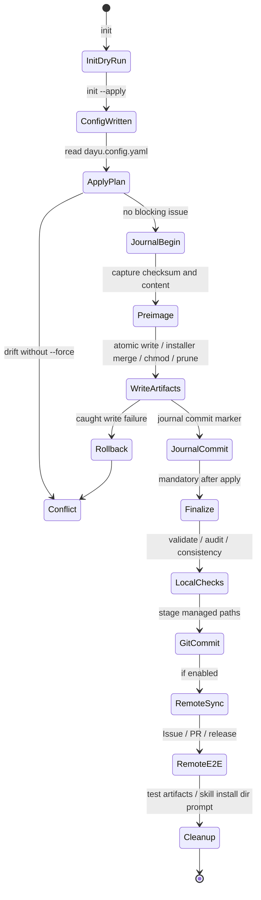

# Phase 2 Product Notes

本文记录 Phase 2 完整产品化后的 CLI 行为、状态机和目标项目结构口径。

## 交付口径

- 当前仓库事实为 20 个 capability manifest。
- 20 个 manifest 均采用 manifest v2 字段：`schemaVersion`、`kind`、`deployment_deps`、`conceptual_deps`、`i18n`、`rse`。
- CLI registry 动态加载 `capabilities/*.json`，不再硬编码 Phase 1 的 4 个能力。
- npm 包名为 `dayu-harness`，bin 指向 `dist/cli/main.js`。
- 用户可见运行时输出展示自然语言能力名；capability key 只保留在 manifest、配置、JSON、维护者命令和调试上下文中。

## CLI 状态机



## 目标项目目录树

```text
<target-project>/
├── AGENTS.md
├── CLAUDE.md
├── dayu.config.yaml
├── .dayu-harness/
│   ├── managed-paths.json      # tracked long-lived managed path state
│   ├── apply.lock              # ignored runtime lock
│   ├── journal.jsonl           # ignored recovery journal
│   └── tmp/                    # ignored runtime cache
├── .husky/
│   ├── commit-msg
│   ├── pre-commit
│   └── pre-push
├── .github/
│   ├── ISSUE_TEMPLATE/
│   ├── dayu-harness/
│   ├── repository/
│   ├── rulesets/
│   ├── scripts/
│   └── workflows/
├── docs/
│   ├── AGENTS.md
│   ├── archive/
│   ├── design-docs/
│   ├── exec-plans/
│   ├── generated/
│   ├── harness/
│   ├── product-specs/
│   ├── references/
│   └── troubleshooting/
├── commitlint.config.cjs
├── eslint.config.cjs
├── .prettierrc
├── .lintstagedrc.json
├── .gitignore
├── release-please-config.json
└── .release-please-manifest.json
```

## 事务语义

Phase 2 apply 在每个写入前记录 preimage：

- `checksum`：写入前内容的 SHA-256。
- `contentBase64`：写入前内容，用于失败 rollback。
- `existed`：写入前文件是否存在。

写入成功后追加 journal commit marker。当前实现覆盖普通异常路径的 rollback，并在再次启动时处理 stale lock 与未提交 journal 的 replay；真实进程级 `kill -9` 端到端 smoke 仍可作为后续验证补强。

状态目录语义：

- `.dayu-harness/managed-paths.json` 是长期状态，用于漂移检测、orphan 判断和 finalize 精确 stage，必须提交。
- `.dayu-harness/apply.lock`、`.dayu-harness/journal.jsonl` 和 `.dayu-harness/tmp/` 是临时/恢复用运行产物，必须忽略。
- 旧 `.dayu` 短目录名不再作为 Phase 2 产品口径中的目标状态目录。

## 命令分组

| 分组 | 命令 |
| --- | --- |
| 配置与部署 | `init`、`apply` |
| 融合与生成 | `merge`、`generate` |
| 修复与检查 | `repair`、`status`、`diagnose`、`validate` |
| 运行时收尾 | `finalize` |

所有命令支持 `--json` 输出机器可读结果。

## 非目标

Phase 2 CLI `apply` 是本地确定性写入层，不隐式执行以下远端或版本控制副作用：

- Git stage、commit、push 或创建初始化 PR。
- GitHub API 写入仓库设置、ruleset 或 workflow permissions。
- 创建验证 Issue、验证分支、验证 PR，或等待远端 GitHub Actions 完成。
- release-please 远端发布验证。

这些操作不是 `apply` 的副作用，但必须由 `/dayu-harness` 的 `finalize` 阶段在 apply 成功后继续完成，不能作为后续建议。`finalize` 根据用户已确认的能力范围，通过 `src/` 内 TypeScript 远端模块、GitHub CLI 或显式 smoke profile 完成本地验证、精确 stage/commit、远端创建/绑定、远端配置回读、Issue/PR E2E、release-please 真实验证，并在完成后清理验证产物。

`finalize` 最后还必须结构化询问是否删除一次性 Skill 安装目录，默认删除，并展示该目录的绝对路径。该删除只作用于 Skill 安装目录，不影响目标项目中的治理体系。
