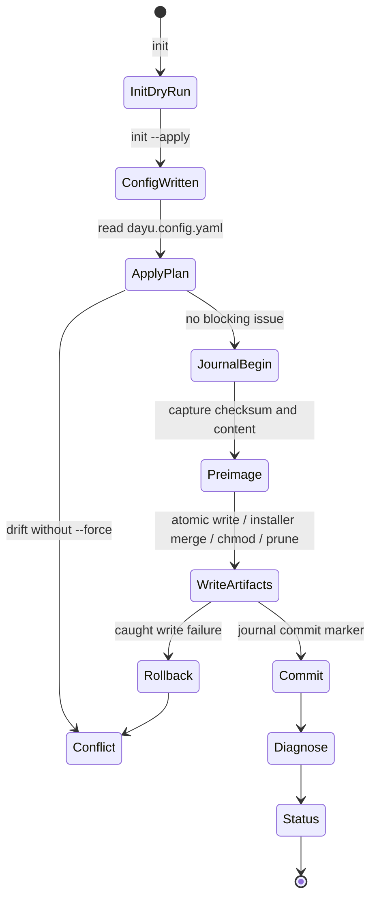

# Phase 2 Product Notes

本文记录 Phase 2 完整产品化后的 CLI 行为、状态机和目标项目结构口径。

## 交付口径

- 当前仓库事实为 20 个 capability manifest。
- 20 个 manifest 均采用 manifest v2 字段：`schemaVersion`、`kind`、`deployment_deps`、`conceptual_deps`、`i18n`、`rse`。
- CLI registry 动态加载 `capabilities/*.json`，不再硬编码 Phase 1 的 4 个能力。
- npm 包名为 `dayu-harness`，bin 指向 `dist/cli/main.js`。

## CLI 状态机



## 目标项目目录树

```text
<target-project>/
├── AGENTS.md
├── CLAUDE.md
├── dayu.config.yaml
├── .dayu/
│   ├── apply.lock
│   ├── journal.jsonl
│   └── managed-paths.json
├── .dayu-log.jsonl
├── .husky/
│   ├── commit-msg
│   ├── pre-commit
│   └── pre-push
├── .github/
│   ├── ISSUE_TEMPLATE/
│   ├── dayu-harness/
│   ├── repository/
│   ├── rulesets/
│   ├── scripts/
│   └── workflows/
├── docs/
│   ├── AGENTS.md
│   ├── archive/
│   ├── design-docs/
│   ├── exec-plans/
│   ├── generated/
│   ├── harness/
│   ├── product-specs/
│   ├── references/
│   └── troubleshooting/
├── commitlint.config.cjs
├── eslint.config.cjs
├── .prettierrc
├── .lintstagedrc.json
├── .gitignore
├── release-please-config.json
└── .release-please-manifest.json
```

## 事务语义

Phase 2 apply 在每个写入前记录 preimage：

- `checksum`：写入前内容的 SHA-256。
- `contentBase64`：写入前内容，用于失败 rollback。
- `existed`：写入前文件是否存在。

写入成功后追加 commit marker。当前实现覆盖普通异常路径的 rollback，并在再次启动时处理 stale lock 与未提交 journal 的 replay；真实进程级 `kill -9` 端到端 smoke 仍可作为后续验证补强。

## 命令分组

| 分组 | 命令 |
| --- | --- |
| 配置与部署 | `init`、`apply` |
| 融合与生成 | `merge`、`generate` |
| 修复与检查 | `repair`、`status`、`diagnose`、`validate` |

所有命令支持 `--json` 输出机器可读结果。

## 非目标

Phase 2 CLI 是本地确定性执行层，不隐式执行以下远端或版本控制副作用：

- Git stage、commit、push 或创建初始化 PR。
- GitHub API 写入仓库设置、ruleset 或 workflow permissions。
- 创建测试 Issue、测试分支、测试 PR，或等待远端 GitHub Actions 完成。
- release-please 远端发布验证。

这些操作必须由 `/dayu-harness` 在用户明确确认后，通过独立辅助脚本、GitHub CLI 或 smoke profile 执行，并在完成后清理测试产物。
